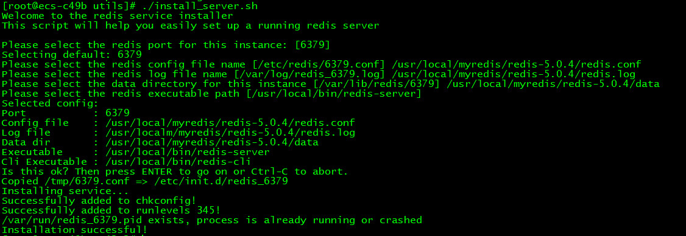

### redis部署
1. `/usr/local`下`mkdir myredis`，依次执行  
    ```
        wget http://download.redis.io/releases/redis-5.0.4.tar.gz
        tar xzf redis-5.0.4.tar.gz  
        cd redis-5.0.4  
        make
        make install
     ```
2. 安装完后，修改redis.conf文件  
69行，`bind 127.0.0.1`改为`bind 0.0.0.0` 允许任意服务器访问  
136行，`daemonize no`改为`daemonize yes`  
507行，设置密码   
3. 安装一个redis服务：  
进入到与redis.conf同级目录的utils中，执行脚本`./install_server.sh` 。  
`systemctl status redis_6379`查看redis状态  
`systemctl start redis_6379`启动服务  
这项服务其实在`/etc/init.d/redis_6379`这个shell文件中，也可以手动修改文件中的内容。

### redis集成
1. `application.properties`中配置好redis相关参数，  
2. `redisConfig`类读取`application.properties`配置的参数，  
3. `RedisPoolFactory`中注入`redisConfig`对象获取配置创建jedis连接池,  
4. `RedisService`类中注入`redisPoolFactory`获取jedis连接池，获取jedis对象提供`get set incr decr exists`等方法  
5. 希望在不同模块添加数据到redis时区分开来，加上各自标识，所以创建了`KeyPrefix`接口，设置前缀和过期时间，抽象类`BasePrefix`
实现了这个接口，`BasePrefix`中设置了前缀为 类名+prefix，具体的`prefix`和过期时间由子类完成设置。
6. 比如存一个SecKill对象，键为 `类名+prefix+本来的键` ，即 `"SecKillUser" + "_token_" + token`，值为SecKill对象的json字符串
### 数据库设计
1. goods表，order表，分别存储商品基本信息(比如id，name,img，price等)，订单基本信息(比如id，用户id，商品id，创建时间等)；  
2. seckill_goods表，用来存储秒杀特有的相关信息，比如商品id，秒杀库存，秒杀价格等；seckill_order表中只存id,用户id，商品id,订单id，user表，seckill_user表中只存用户
id，昵称，用户加密后的密码，盐值等。
### 两次md5加密
1. http在网络上通过明文传输，第一次加密防止用户密码明文传输到服务端，在客户端进行加密，采用明文+固定salt；  
2. 第二次在服务端再进行加密，采用客户端传过来的加密密码+随机salt，然后存入数据库(这个随机salt也存入数据库)。  
加密参考`MD5Util`类  
### JSR303自定义注解
登录逻辑见`LoginController`和`SecKillUserService.login`。在`LoginVo`类中使用自定义注解`@IsMobile`判断输入的`mobile`是否合法。
`@IsMobile`由`IsMobile`和`IsMobileValidator`两个类完成自定义注解的实现。
### 全局异常处理
`@ControllerAdvice`和`@ExceptionHandler`实现全局异常处理，`cn.andios.seckill.exception.GlobeExceptionHandler`
### 分布式session
用户登录认证成功后，页面跳转到商品列表页(对应`GoodsController`)，后台给用户生成一个唯一标识token
   - 需要把用户信息存入redis  
    前缀+prefix+唯一标识token作为键，用户对象json字符串作为值，设置过期时间，存入redis。
   - 向客户端回写cookie  
   生成一个cookie，设置cookie过期时间与存入redis的键过期时间一致，将cookie通过HttpServletResponse回写给客户端。  
登录认证成功后，后请求/goods/to_list跳转到商品列表页，请求`GoodsController`时，客户端会把response回写的cookie带过来，服务端根据这个cookie再去
redis中取用户信息，如果取不到，则表明未登录或session失效，如果取到了就更新过期时间。这个操作在服务端的多个地方都会调用，所以配置了一个参数解析器，
从request中获取token等信息，判断用户是否登录。见`UserArgumentResolver`类，它继承自`HandlerMethodArgumentResolver`，再在`WebConfig`中将
它添加到容器中，那么`GoodsController`中就不需要判断用户token信息了。(后期为了实现自定义注解`@AccessLimit`，实现了拦截器`AccessInterceptor`，
拦截器会在参数解析器之前执行，也需要根据token获取用户信息，所以这部分封装在了拦截器中，拦截器中获取的secKillUser放在ThreadLocal中，参数解析器直接
从ThreadLocal中取即可)
### redis压测
使用`redis-benchmark`测试redis的性能:  
一百个并发，10万个请求：`redis-benchmark -h 127.0.0.1 -p 6379 -c 100  -n 100000`   
存取大小为100字节的数据包：`redis-benchmark -h 127.0.0.1 -p 6379 -q -d 100`   
只测试部分命令：`redis-benchmark -t set,lpush -q -n 100000`  
### JMeter命令行测试
1. windows上用JMeter录好测试文件`xxx.jmx`
2. CentOS中
下载解压JMeter,进入bin中执行`./jmeter.sh -n -t xxx.jmx -l result.jtl`,即执行压测，压测完当前目录下生成result.jtl文件即压测报告，
将压测报告下载到windows中用JMeter打开即可。`xxx.jmx`可以用`xxx.txt`作为数据文件，比如存放接口参数，`xxx.jmx`中指定`xxx.txt`文件位置即可。
查看cpu核数：`cat /proc/cpuinfo | grep  processor`
### nohup &
原程序的的标准输出被自动改向到当前目录下的`nohup.out`文件中，起到了log的作用。  
要运行后台中的`nohup`命令，添加 & （ 表示”and”的符号）到命令的尾部。  
比如`nohup /root/start.sh &`,该脚本的输出会在当前目录的nohup.out文件中，该脚本会在后台运行。
### 文件传输
#### sz,rz
rz，sz是Linux/Unix同Windows进行ZModem文件传输的命令行工具，优点就是不用再开一个sftp工具登录上去上传下载文件。  
`sz`：将选定的文件发送（send）到本地机器。  
`rz`：运行该命令会弹出一个文件选择窗口，从本地选择文件上传到Linux服务器。  
安装：`yum install lrzsz`  
从服务端(CentOS)发送文件到客户端(windows)：`sz filename`  
从客户端(windows)上传文件到服务端(CentOS)：`rz`,在弹出的框中选择文件，上传文件的用户和组是当前登录的用户  
SecureCRT设置默认路径：  
Options -> Session Options -> Terminal -> X/Y/Zmodem ->Directories  
Xshell设置默认路径：  
右键会话 -> 属性 -> ZMODEM -> 接收文件夹  
#### sftp
SecureCRT中`alt+p`即可进入，在 Options->Session Options->Connection->SSH2->SFTP Session  
pwd: 查询linux主机所在目录(也就是远程主机目录)  
lpwd: 查询本地目录（一般指windows上传文件的目录）  
ls: 查询连接到当前linux主机所在目录有哪些文件  
lls: 查询当前本地上传目录有哪些文件  
lcd: 改变本地上传目录的路径  
cd: 改变远程上传目录  
get: 将远程目录中文件下载到本地目录  
put: 将本地目录中文件上传到远程主机(linux)  
quit: 断开FTP连接  
### 页面优化
1. 页面缓存+url缓存+对象缓存---减轻数据库压力  
    - 页面缓存：GoodsController中改进的list，detail方法。取的时候先从缓存中取，如果没有取到，就先使用ThymeleafViewResolver根据参数生成html页面，
再存入redis中。缓存时间一般较短。  
    - 对象缓存：SecKillUserService中的getById,updatePassword(更新密码时先更新数据库，再更新缓存，原因参见下面的博客)方法。取对象时，先从缓存中
    取，如果没有，就从数据库中取。更新对象时，注意要更新缓存。
2. 页面静态化 前后端分离  
    - 常用技术angular js、vue (这里使用的jQuery)  
    - 比如GoodsController中改进的detail2方法，SecKillController中的secKill2方法，OrderController中的orderInfo方法。原来(比如SecKillController中
    的secKill1方法)返回的是字符串，由thymeleaf自动映射成template目录下的页面，现在是返回一个自定义的结果对象(`cn.andios.seckill.result.Result`),
    将数据放在这个结果对象中，前台通过ajax请求获取数据，再通过jQuery渲染页面。两者请求方式也不一样，比如`goods_list.html`中，如果是页面静态化，
    则直接链接到指定页面，然后在这个页面中调用ajax向controller请求数据，如果不是页面静态化，通过thymeleaf解析，就路由到controller的路径，由
    controller直接处理请求跳转到指定页面
    - 浏览器缓存  
3. 页面资源优化  
    - js/css压缩，减少浏览  
    - 多个js/css组合，减少连接数(比如淘宝Tengine,webpack)  
4. cdn优化    
### 接口优化
1. Redis预减库存，内存标记减少数据库访问
    1. 系统初始化，把商品库存数量加载到Redis中
    2. 收到请求，内存标记减少Redis访问预减库存，库存不足，直接返回，否则进入3
    3. 请求入队，放到消息队列中，立即返回排队中
    4. 请求出队，生成订单，减少库存 
    5. 客户端轮询，是否秒杀成功 
    `SecKillController.secKill2`到`SecKillController.secKill3`
3. 请求先入队缓冲，异步下单，增强用户体验
4. RabbitMQ集成spring boot
    1. `application.properties`中配置好rabbitmq参数
    2. 控制层将秒杀请求封装入队并立即返回
    3. 消费端(`MQReceiver.receiveSecKillMessage`)取出消息执行秒杀逻辑
    4. 前台请求轮询(`SecKillController.secKillResult`)获取秒杀结果
5. nginx水平扩展，方向代理
6. 压测/usr/local/myerlang/erlang20/bin
### 安全优化
#### 秒杀接口地址隐藏
思路：`goods_detail.htm`中点击立即秒杀，先去请求`secKill/path`接口校验验证码，获取秒杀地址path,然后带着path访问真正的秒杀接口`/secKill/{path}/do_secKill4`
#### 数学公式校验码(安全、分散用户请求)
1. 添加生成验证码的接口
2. 获取秒杀路径时，验证验证码
3. ScriptEngine使用
`goods_detail.htm`页面加载完成时就会请求`/secKill/verifyCode`接口中生成验证码，用户点击秒杀会先请求`secKill/path`接口校验验证码
#### 接口限流防刷
单个地方使用：`SecKillController.secKillPath`    
通用设置：自定义注解`AccessLimit`，自定义拦截器`AccessInterceptor`,发现类上面有`AccessLimit`注解后就会进行判断

-----------------------------------
## 常见问题
1. 防止超卖：  
    1. 防止同一用户多次秒杀：设置`user_id`和`goods_id`的唯一索引
    2. 保证stock_count>0：`update seckill_goods set stock_count = stock_count - 1 where id=#{goodsId} and stock_count > 0`
    3. 乐观锁：`update seckill_goods set count = count - 1, version = version + 1 where id=#{goodsId} and version = #{version}`
    4. redis预减库存减少数据库访问　内存标记减少redis访问
    5. 悲观锁虽然可以解决超卖，但加锁的时间可能会很长，限制其他用户访问，如果请求过多系统可能会出现异常。乐观锁不加锁，如果失败直接返回，可以承受高并发。

2.
    mysql悲观锁：对数据被外界（包括本系统当前的其他事务，以及来自外部系统的事务处理）修改持保守态度，因此，在整个数据处理过程中，将数据处于锁定状态。
    悲观锁的实现，往往依靠数据库提供的锁机制
    排它锁：`...for update`,没有加锁的事务只要在select时不加排它锁也可以查询事务
    共享锁：`lock in share mode`
    `begin`
    `select stock_count from seckill_goods where id = #{goodsId} for update`
    `update seckill_goods set stock_count = stock_count - 1`
    `commit`  
4. 
    mysql乐观锁：总是认为不会产生并发问题，每次去取数据的时候总认为不会有其他线程对数据进行修改，因此不会上锁，但是在更新时会判断其他线程在这之前
    有没有对数据进行修改，使用版本号机制或CAS操作实现。
    
  
----------------------------------  
## 秒杀系统特点
- 高性能：支持大量的并发读写
- 一致性：有限数量的商品在同一时刻被很多倍的请求来减库存，要保证数据的准确性
- 高可用：秒杀时一瞬间会涌入大量流量，要避免系统宕机
## 优化
- 后端优化：将请求尽量拦截在系统上游
    - 限流：只允许少部分的流量走到后端。  
        实现方案：
        1. `Guava RateLimiter` (本项目中用的Guava RateLimiter)  
        2. redis计数限流 [参考](https://github.com/TaXueWWL/shield-ratelimter)
    - 削峰：避免瞬时流量压垮系统,因此延缓用户请求，让落到数据库的请求尽量少
        - 思路：缓存瞬时流量，让服务器资源平缓处理请求。
        - 方案：
            1. 用消息队列，把同步的直接调用转成异步的间接推送，中间通过一个队列承接瞬时的流量洪峰,这里用的`RabbitMQ`
            2. 让用户答题，比如这里的数学公式，一方面**防止用户作弊**，同时可以**延缓请求**，如果做一些图片题目，要把图片推送到CDN上，防止
                加载慢，影响体验。
            3. 分层过滤。比如请求经过CDN->前台读系统->后台写系统->数据库，那么CDN这层就可以过滤掉大量的图片，静态资源的请求。前台读系统对读不做强一致性要求，
                防止一致性校验产生瓶颈的问题。最后在写数据时要保证强一致性，
    - 异步：将同步请求转为异步请求，也即削峰处理。
    - 缓存：创建订单时，会先判断库存，可将商品信息放在缓存中，减少数据库的访问。
    - 负载均衡：利用Nginx等使用多个服务器并发处理请求，减少单个服务器压力。
- 前端优化：
    - 让用户答题，一方面**防止用户作弊**，同时可以**延缓请求**
    - 禁止重复提交，每发起一次秒杀后，需等待一定时间
    - 用户秒杀到商品后，将提交按钮置灰
    - 将前端静态数据直接放缓从离用户最近的地方，比如用户浏览器、CDN
- 防作弊优化：
    - 隐藏秒杀接口，防止恶意用户刷接口
    - 一个账号，一次性发送多个请求：用户通过浏览器插件或其他工具一次性发送多个请求。
        - 解决方案：在程序入口处，一个账号只允许接受1个请求，其他请求过滤。不仅解决了同一个账号，发送N个请求的问题，还保证了后续的逻辑流程的安全。
        - 实现方案：可以通过Redis这种内存缓存服务，写入一个标志位（只允许1个请求写成功，结合watch的乐观锁的特性），成功写入的则可以继续参加。
    - 多个账号一次性发送多个请求：比如微博上的僵尸账号。
        - 解决方案：如果同一IP地址请求频率过高，可以弹出验证码或者封IP
    - 检测账号活跃度或等级信息，对僵尸用户进行限制
----------------------------------- 
## 一致性问题
### Cache Aside Pattern
- 实现起来比较简单，但是需要维护两个数据存储，一个是缓存，一个是数据库。
- 读操作从缓存中取数据，取到后返回，如果没有取到，从数据库中取，成功后，把数据放到缓存中。
- 写操作先更新数据库，再让缓存失效。
- 误区：
    1. 写操作先删缓存再更新数据库(防止并发读写)：线程A写操作删除缓存-->线程B读操作从缓存中读，没有取到，从数据库中读->线程B更新缓存-->线程A更新数据库-->结束  
        此时数据库和缓存中数据不一致，应用程序读取的是脏数据。
    2. 写操作更新数据库后更新缓存(防止两个并发写)：线程A写操作更新数据库->线程B写操作更新数据库->线程B更新缓存->线程A更新缓存->结束  
        此时数据库和缓存中数据不一致，应用程序读取的是脏数据。
    3. 写操作更新数据库后删除缓存(防止读中包含写)：线程A读缓存，取不到去读数据库->线程B写操作更新数据库->线程B删除缓存->线程A将读到的数据更新回了缓存->结束  
        此时数据库和缓存中的数据不一致应用程序读取的是脏数据。  
        但这种情况是读-写-写-读，实际数据库的写操作会比读操作慢得多，所以这种情况概率不大。但是为了避免这种极端情况造成脏数据所产生的影响，我们还是要为缓存设置过期时间。  
        另外，由于每次都删除缓存，因此导致多次缓存都不能命中，对性能有一定影响。
### Read/Write Through
- 只需要维护一个数据存储（缓存），但是实现起来要复杂一些，数据持久化操作是同步的。
- Read Through：读操作从缓存中取数据，如果取到直接返回，如果没有取到，就从数据库中取数据到缓存中，再将数据返回
- Write Through：写操作更新数据库时，命中缓存则更新缓存，再由缓存更新数据库；没有命中缓存，直接更新数据库
### Write Behind Caching
- 更新数据时，只更新缓存，不更新数据库，然后由缓存异步批量更新数据库。  
    好处：直接操作内存，速度快；异步操作，还可以合并对同一个数据的多次操作到数据库，提高性能。  
    问题：数据不是强一致性的。
    
    